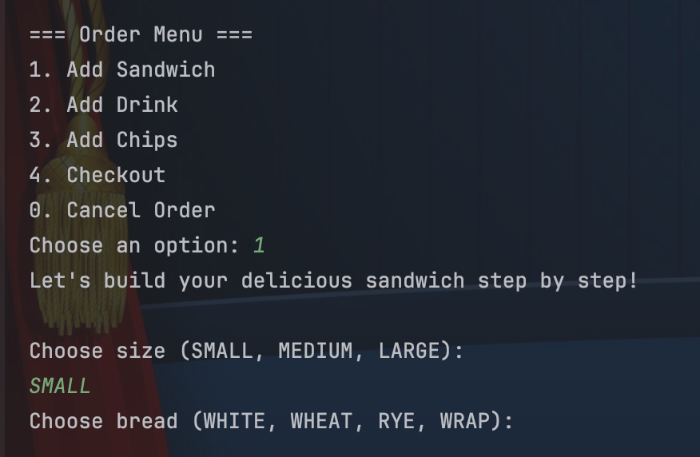
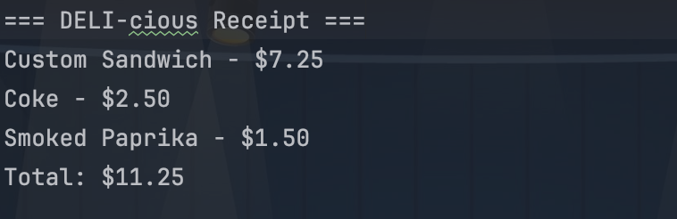
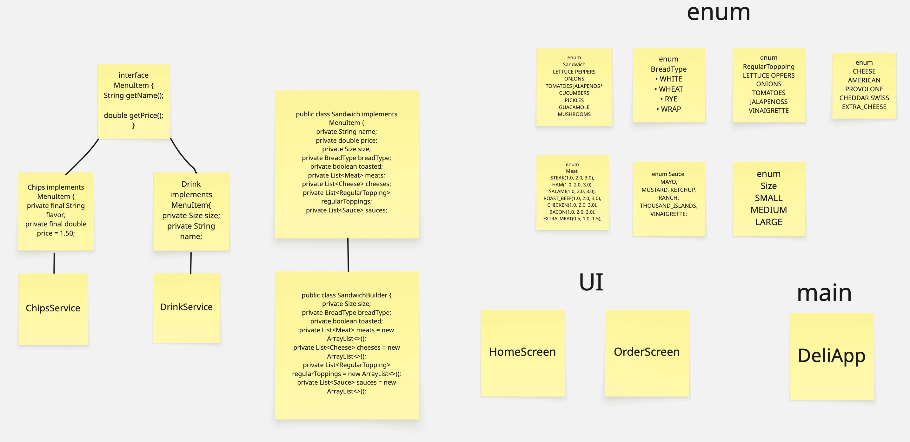

# 🥪 DELI-cious - Java CLI Sandwich Shop

## 📜 Project Description

**DELI-cious** is a Java command-line application for placing sandwich shop orders.

---

### 💡 **What the user can do:**

* Build a custom sandwich by choosing size, bread, toppings, sauces, and toast options
* Add multiple sandwiches, drinks, and chips to one order
* View a full summary of the order
* Get a receipt with the current time
* Easily navigate using a menu-driven interface

---

### 🛠️ **What this project demonstrates:**

**Object-Oriented Programming (OOP) principles such as:**

* **Encapsulation** – keeping data and logic inside classes
* **Abstraction** – hiding complex implementation and showing only important features (e.g., using interfaces)
* **Polymorphism** – treating different types of items (sandwiches, drinks, chips) in the same way through a shared interface
* **Interfaces** and **enums** – for structure, reusability, and readability
* **Generics** – for reusable methods that work with different enum types (like selecting size or toppings)

---

The code is **modularly structured** using packages like:

* `models` – for data classes like Sandwich, Drink, etc.
* `services` – for logic like order handling and user input
* `enums` – for types like Size, Cheese, Bread, etc.

---

## 🖥️ Application Screenshots

### 🏠 Home Screen


### 🥪 Sandwich Builder in Action


### 📋 Checkout Screen


---

## 💡 Interesting Code: SandwichBuilder.java

* One of the most interactive and dynamic parts of the application is the `SandwichBuilder` class,
* which walks the user through building their own sandwich using reflection and generic programming to streamline enum input.

### 🔍 Code Snippet

```java
private <T extends Enum<T>> T promptEnum(Scanner scanner, String prompt, Class<T> enumClass) {
    T selection = null;
    String options = enumOptions(enumClass);
    while (selection == null) {
        System.out.println(prompt + " (" + options + "):");
        String input = scanner.nextLine().trim().toUpperCase();
        if (input.isEmpty()) {
            System.out.println("⚠️ Input cannot be empty. Please try again.");
            continue;
        }
        try {
            selection = Enum.valueOf(enumClass, input);
        } catch (IllegalArgumentException e) {
            System.out.println("❌ Invalid input. Please choose one of: " + options);
        }
    }
    return selection;
}
````

### ✅ Why It’s Interesting:

* Uses Java Generics and reflection to dynamically prompt and validate enum values.
* Clean, reusable design that reduces duplication for handling various sandwich components.
* Provides rich CLI user feedback with validation and formatted enum options.

---

## 🧱 Class Diagram (Design)



---

## 🚀 Getting Started

### 🔧 Prerequisites

* Java 17+
* Git
* IntelliJ IDEA or any preferred IDE
* Terminal (or command prompt)

### 📥 Installation & Running

1. Clone the repo:

   ```bash
   git clone https://github.com/karina-krupodior/capstone-2.git
   cd DELI-cious
   ```

2. Open the project in your IDE.

3. Run the `DeliApp.java` file in the CLI.

---


## 📌 Features

* Sandwich customization (bread, size, meats, cheese, toppings, sauces)
* Drink and chip selection
* Live price calculation based on size and extras
* Receipt generation in `receipts/` folder (timestamped .txt files)
* User-friendly console interface
* Modular OOP design

---

## 👩‍💻 Author

**Karyna Krupodor** –
[GitHub](https://github.com/karina-krupodior)

```
