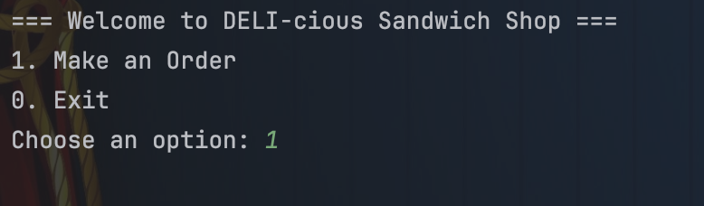

# 🥪 DELI-cious - Java CLI Sandwich Shop

## 📜 Project Description

**DELI-cious** is a Java-based Command Line Interface (CLI) point-of-sale (POS) application for a customizable sandwich shop.

The user can:

- Create custom sandwiches by choosing size, bread, toppings, sauces, and toast preference.
- Add multiple sandwiches, drinks, and chips to the same order.
- View detailed order summaries.
- Generate timestamped receipts.
- Navigate through an intuitive menu-driven interface.

- This project showcases OOP principles such as encapsulation, abstraction, inheritance, and polymorphism,
- and is modularly structured using packages like `models`, `services`, and `enums`.

---

## 🖥️ Application Screenshots

### 🏠 Home Screen


### 🥪 Sandwich Builder in Action


### 📋 Checkout Screen


---

## 💡 Interesting Code: SandwichBuilder.java

One of the most interactive and dynamic parts of the application is the `SandwichBuilder` class,
- which walks the user through building their own sandwich using reflection and generic programming to streamline enum input.

### 🔍 Code Snippet

```java
private <T extends Enum<T>> T promptEnum(Scanner scanner, String prompt, Class<T> enumClass) {
    T selection = null;
    String options = enumOptions(enumClass);
    while (selection == null) {
        System.out.println(prompt + " (" + options + "):");
        String input = scanner.nextLine().trim().toUpperCase();
        if (input.isEmpty()) {
            System.out.println("⚠️ Input cannot be empty. Please try again.");
            continue;
        }
        try {
            selection = Enum.valueOf(enumClass, input);
        } catch (IllegalArgumentException e) {
            System.out.println("❌ Invalid input. Please choose one of: " + options);
        }
    }
    return selection;
}
````

### ✅ Why It’s Interesting:

* Uses Java Generics and reflection to dynamically prompt and validate enum values.
* Clean, reusable design that reduces duplication for handling various sandwich components.
* Provides rich CLI user feedback with validation and formatted enum options.

---

## 🧱 Class Diagram (Design)

> Save your diagram as `images/class-diagram.png` or export from tools like Lucidchart, UMLet, or IntelliJ and reference here:


---

## 🚀 Getting Started

### 🔧 Prerequisites

* Java 17+
* Git
* IntelliJ IDEA or any preferred IDE
* Terminal (or command prompt)

### 📥 Installation & Running

1. Clone the repo:

   ```bash
   git clone https://github.com/karina-krupodior/capstone-2.git
   cd DELI-cious
   ```

2. Open the project in your IDE.

3. Run the `Main.java` file in the CLI.

---

## 🗃️ Project Structure

```
src/
├── models/
│   └── Sandwich.java
├── models/enums/
│   └── Size.java, BreadType.java, Meat.java, Cheese.java, etc.
├── services/
│   └── SandwichBuilder.java, OrderManager.java, ReceiptWriter.java
├── Main.java
```

---

## 📌 Features

* Sandwich customization (bread, size, meats, cheese, toppings, sauces)
* Drink and chip selection
* Live price calculation based on size and extras
* Receipt generation in `receipts/` folder (timestamped .txt files)
* User-friendly console interface
* Modular OOP design

---

## 👩‍💻 Author

**Karyna Krupodor** –
[GitHub](https://github.com/karina-krupodior)

```
